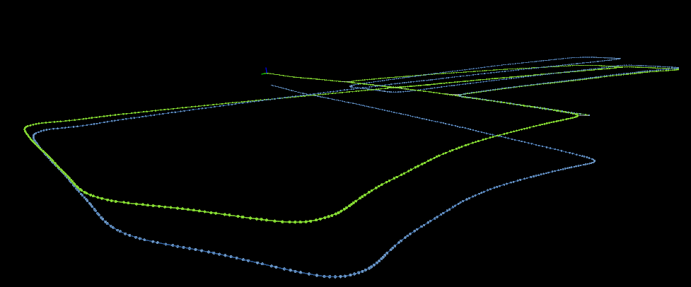

# FAST-LIO-SAM
+ This repository is a SLAM implementation combining [FAST-LIO2](https://github.com/hku-mars/FAST_LIO) with pose graph optimization and loop closing based on [LIO-SAM](https://github.com/TixiaoShan/LIO-SAM) paper
    + Loop-detection is based on radius search and ICP is used to calc matching
+ Note: similar repositories already exist
    + [FAST_LIO_LC](https://github.com/yanliang-wang/FAST_LIO_LC): FAST-LIO2 + SC-A-LOAM based SLAM
    + [FAST_LIO_SLAM](https://github.com/gisbi-kim/FAST_LIO_SLAM): FAST-LIO2 + ScanContext based SLAM
    + [FAST_LIO_SAM](https://github.com/kahowang/FAST_LIO_SAM): FAST-LIO2 + LIO-SAM
+ Note2: main code (PGO) is modularized and hence can be combined with any other LIO / LO
    + This repo is to learn GTSAM myself!
    + and as GTSAM tutorial for beginners - [GTSAM 튜토리얼 한글 포스팅](https://engcang.github.io/2023/07/15/gtsam_tutorial.html)

<p align="center">
  
  
  <br>
  <em>KITTI seq 05 top view - (left): FAST-LIO2 (right): FAST-LIO-SAM</em>
</p>
<p align="center">
  
  
  <br>
  <em>KITTI seq 05 side view - (top): FAST-LIO2 (bottom): FAST-LIO-SAM</em>
</p>
<p align="center">
  
  <br>
  <em>KITTI seq 05 trajectories - (blue): FAST-LIO2 (green): FAST-LIO-SAM</em>
</p>

<br>


## Note
+ For better loop-detection and transform calculation, [FAST-LIO-SAM-QN](https://github.com/engcang/FAST-LIO-SAM-QN) is also coded and opened.
    + It adopts [Quatro](https://github.com/url-kaist/Quatro) - fast, accurate and robust global registration which provides great initial guess of transform
    + and [Nano-GICP](https://github.com/vectr-ucla/direct_lidar_odometry) - fast and accurate ICP combining [FastGICP](https://github.com/SMRT-AIST/fast_gicp) + [NanoFLANN](https://github.com/jlblancoc/nanoflann)


<br>

## Dependencies
+ ROS (it comes with `Eigen` and `PCL`)
+ [GTSAM](https://github.com/borglab/gtsam)
    ```shell
    wget -O gtsam.zip https://github.com/borglab/gtsam/archive/refs/tags/4.1.1.zip
    unzip gtsam.zip
    cd gtsam-4.1.1/
    mkdir build && cd build
    cmake -DGTSAM_BUILD_WITH_MARCH_NATIVE=OFF -DGTSAM_USE_SYSTEM_EIGEN=ON ..
    sudo make install -j16
    ```

## How to build
+ Get the code and build
    ```shell
    cd ~/your_workspace/src
    git clone https://github.com/engcang/FAST-LIO-SAM --recursive

    cd ..
    catkin build -DCMAKE_BUILD_TYPE=Release
    . devel/setup.bash
    ```

## How to run
+ Then run (change config files in third_party/`FAST_LIO`)
    ```shell
    roslaunch fast_lio_sam run.launch lidar:=ouster
    roslaunch fast_lio_sam run.launch lidar:=velodyne
    roslaunch fast_lio_sam run.launch lidar:=livox
    ```
- In particular, we provide a preset launch option for specific datasets:
    ```shell
    roslaunch fast_lio_sam run.launch lidar:=kitti
    roslaunch fast_lio_sam run.launch lidar:=mulran
    roslaunch fast_lio_sam run.launch lidar:=newer-college20
    ```

<br>

### Structure
+ odomPcdCallback
    + pub realtime pose in corrected frame
    + keyframe detection -> if keyframe, add to pose graph + save to keyframe queue
    + pose graph optimization with iSAM2
+ loopTimerFunc
    + process a saved keyframe
        + detect loop -> if loop, add to pose graph
+ visTimerFunc
    + visualize all **(Note: global map is only visualized once uncheck/check the mapped_pcd in rviz to save comp.)**

<br>

## License
<a rel="license" href="http://creativecommons.org/licenses/by-nc-sa/4.0/"></a>

This work is licensed under a [Creative Commons Attribution-NonCommercial-ShareAlike 4.0 International License](http://creativecommons.org/licenses/by-nc-sa/4.0/)
